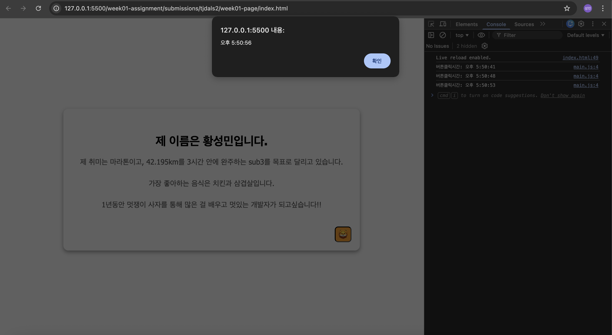
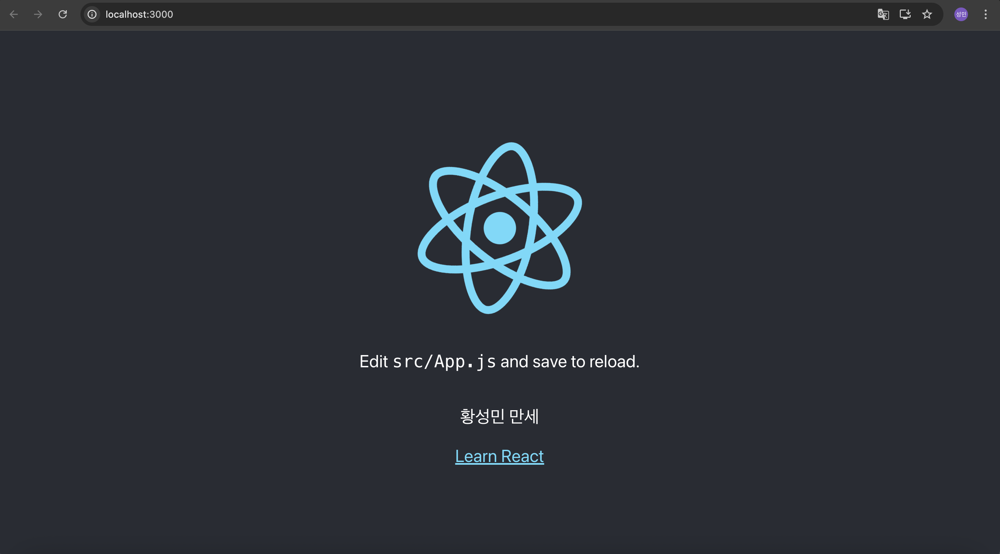

실습1
Last login: Wed Apr  1 17:45:33 on ttys019
hwangsungmin@hwangseongmin-ui-MacBookAir ~ % node --version
v24.14.0
hwangsungmin@hwangseongmin-ui-MacBookAir ~ % npm --version
11.9.0
hwangsungmin@hwangseongmin-ui-MacBookAir ~ % java -version
openjdk version "21.0.8" 2025-07-15 LTS
OpenJDK Runtime Environment Temurin-21.0.8+9 (build 21.0.8+9-LTS)
OpenJDK 64-Bit Server VM Temurin-21.0.8+9 (build 21.0.8+9-LTS, mixed mode, sharing)
hwangsungmin@hwangseongmin-ui-MacBookAir ~ % git --version
git version 2.50.1 (Apple Git-155)
hwangsungmin@hwangseongmin-ui-MacBookAir ~ % javac -version
javac 21.0.8

실습2

실습3 : 개인저장소 URL 
https://github.com/tjdals2/likelion.git

실습4

실습5
미진행
